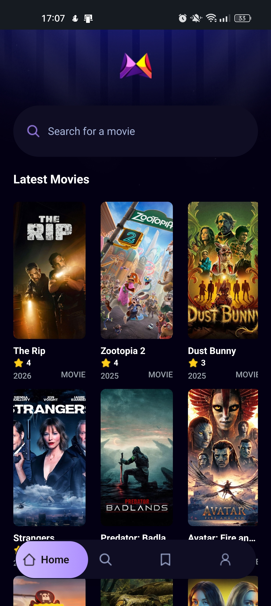
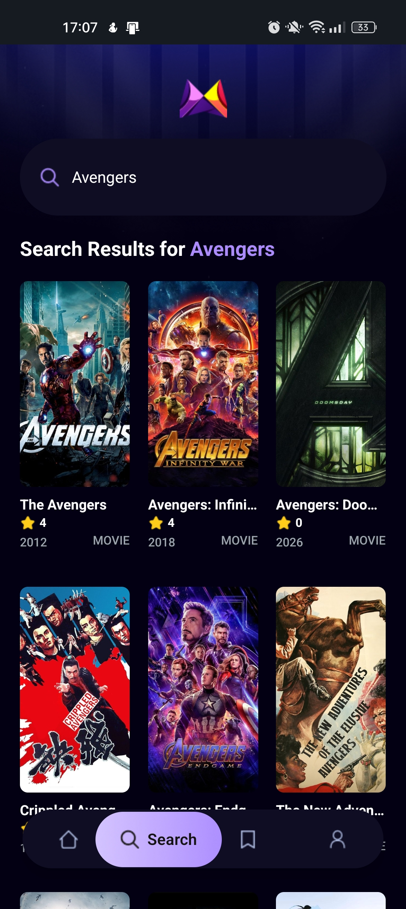
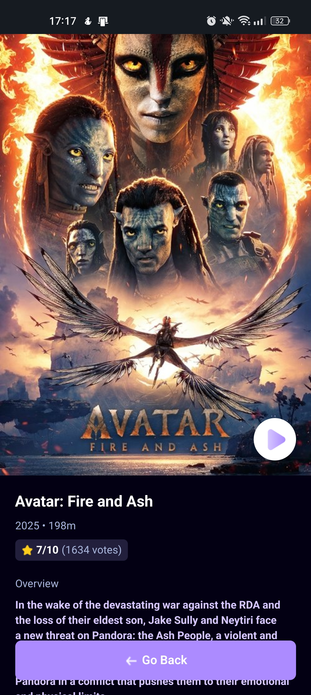

# React Native Movie App

A modern mobile application for browsing and discovering movies, built with React Native and Expo. This app provides an intuitive interface for users to explore the latest movies and search for their favorites.

<p align="center">
  
</p>

## ✨ Features

- 🎬 **Browse Latest Movies** - View the latest and popular movies
- 🔍 **Search Functionality** - Search for movies by title with real-time results
- 📱 **Responsive Design** - Optimized for various screen sizes
- 🎨 **Modern UI** - Clean and intuitive user interface with smooth animations
- 📊 **Movie Details** - View comprehensive information about each movie
- 🌙 **Dark Theme** - Eye-friendly dark theme throughout the app

## 📸 Screenshots

<p align="center">
  
  
  
</p>

## 🛠️ Tech Stack

- **React Native** - Cross-platform mobile development
- **Expo SDK 54** - Development framework and tooling
- **TypeScript** - Type-safe code
- **NativeWind** - Tailwind CSS for React Native
- **React Navigation** - Navigation library
- **TMDB API** - Movie database API
- **Expo Router** - File-based routing

## 📋 Prerequisites

Before you begin, ensure you have the following installed:
- [Node.js](https://nodejs.org/) (v16 or higher)
- [npm](https://www.npmjs.com/) or [yarn](https://yarnpkg.com/)
- [Expo Go](https://expo.dev/client) app on your mobile device
- TMDB API Key (get it from [The Movie Database](https://www.themoviedb.org/settings/api))

## 🚀 Getting Started

### 1. Clone the repository

```bash
git clone https://github.com/vincentbui21/react-native-movie-app.git
cd react-native-movie-app
```

### 2. Install dependencies

```bash
npm install --legacy-peer-deps
```

### 3. Set up environment variables

Create a `.env` file in the root directory:

```env
EXPO_PUBLIC_MOVIE_API_KEY=your_tmdb_api_key_here
```

### 4. Start the development server

```bash
npx expo start
```

### 5. Run the app

- **On Android**: Scan the QR code with the Expo Go app
- **On iOS**: Scan the QR code with your camera app
- **On Web**: Press `w` in the terminal

## 📱 App Structure

```
app/
├── (tabs)/           # Tab navigation screens
│   ├── index.tsx     # Home screen
│   ├── search.tsx    # Search screen
│   ├── save.tsx      # Saved movies (coming soon)
│   └── profile.tsx   # User profile (coming soon)
├── movie/
│   └── [id].tsx      # Movie details screen
└── _layout.tsx       # Root layout

components/           # Reusable components
├── MovieCard.tsx     # Movie card component
├── SearchBar.tsx     # Search input component
└── TrendingCard.tsx  # Trending movie card

services/             # API and data services
├── api.ts            # TMDB API integration
└── usefetch.ts       # Custom fetch hook
```

## 🎯 Available Scripts

- `npm start` - Start the Expo development server
- `npm run android` - Start on Android emulator/device
- `npm run ios` - Start on iOS simulator/device
- `npm run web` - Start on web browser

##  Upcoming Features

- 💾 Save/Bookmark favorite movies
- 👤 User profile and preferences
- 🎭 Filter movies by genre
- ⭐ Movie ratings and reviews
- 📺 TV Shows support
- 🌐 Multi-language support

## 🤝 Contributing

Contributions, issues, and feature requests are welcome! Feel free to check the issues page.

## 📄 License

This project is open source and available under the [MIT License](LICENSE).

## 👨‍💻 Author

**Kiet Bui**

---

⭐ If you found this project helpful, please give it a star!
